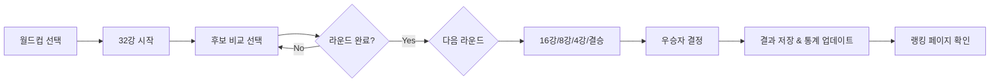

# 🎮 Ideal Type World Cup & Quiz Game Platform

> **"나만의 이상형 월드컵과 퀴즈를 만들고 공유하세요!"**  
> 실시간 인터렉션과 커뮤니티 기반의 몰입형 게임 플랫폼

[](https://vuejs.org/)
[](https://element-plus.org/)
[](https://pinia.vuejs.org/)
[](https://vitejs.dev/)

---

## 📑 목차

1. [프로젝트 소개](#1-프로젝트-소개)
2. [주요 기능](#2-주요-기능)
3. [기술 스택](#3-기술-스택)
4. [프로젝트 구조](#4-프로젝트-구조)
5. [설치 및 실행](#5-설치-및-실행)
6. [API 명세](#6-api-명세)
7. [디자인 시스템](#7-디자인-시스템)
8. [핵심 구현 사항](#8-핵심-구현-사항)
9. [팀 협업 가이드](#9-팀-협업-가이드)
10. [개발자 가이드](#10-개발자-가이드)

---

## 1. 프로젝트 소개

### 📖 프로젝트 개요

**Ideal Type World Cup & Quiz Game**은 사용자가 직접 콘텐츠를 제작하고 공유할 수 있는 인터랙티브 게임 플랫폼입니다. 

- **이상형 월드컵**: 32강 토너먼트 방식의 이상형 선택 게임
- **타임 어택 퀴즈**: 제한 시간 내에 정답을 맞히는 긴장감 넘치는 퀴즈
- **커뮤니티**: 다른 사용자들이 만든 콘텐츠를 즐기고 평가

### 📅 개발 기간

- **2025.XX.XX ~ 2025.XX.XX** (약 X주)

### 🎯 프로젝트 목표

1. **사용자 주도형** 콘텐츠 생태계 구축
2. **실시간 인터렉션**을 통한 몰입도 향상
3. **모던 프론트엔드** 기술 스택 활용
4. **직관적인 UX/UI** 설계로 사용자 경험 극대화

### � 주요 지표

| 항목 | 내용 |
|:---:|:---|
| **총 페이지 수** | 10+ 페이지 (홈, 게임, 결과, 랭킹, 제작 등) |
| **컴포넌트 수** | 20+ 재사용 가능한 Vue 컴포넌트 |
| **API 엔드포인트** | 25+ RESTful API |
| **상태 관리** | Pinia Store (auth, worldcup, quiz, transition) |

---

## 2. 주요 기능

### 🏆 이상형 월드컵

#### Core Features
- **토너먼트 시스템**: 32강, 16강, 8강, 4강, 결승 진행
- **실시간 진행률**: 현재 라운드 및 매치 진행 상황 시각화
- **통계 분석**: 승률, 출전 횟수, 최종 우승 횟수 트래킹
- **랭킹 시스템**: 인기 후보 실시간 순위 제공
- **사용자 제작**: 자신만의 월드컵 생성 및 공유

#### User Flow


### 🧠 타임 어택 퀴즈

#### Core Features
- **시간 제한**: 문제당 제한 시간 내 정답 맞히기
- **실시간 점수**: 정답 속도에 따른 차등 점수
- **티어 시스템**: 점수에 따른 6단계 티어 (멘사 ~ 노력필요)
- **명예의 전당**: TOP 10 랭킹 시스템
- **패스 기능**: 어려운 문제 나중으로 미루기

#### Scoring System
```javascript
// 티어 분류
멘사: 100점
수재: 80-90점
우등생: 60-80점
모범생: 40-60점
평범: 20-40점
노력필요: 20점 미만
```

### 👤 사용자 시스템

#### Authentication
- **JWT 기반** 인증 시스템
- **Access Token** + **Refresh Token** 구조
- **로그인 모달**: 비로그인 사용자 대상 자동 표시

#### Authorization
- **권한 기반** 콘텐츠 제작 제한
- **본인 콘텐츠** 수정/삭제 권한 관리

---

## 3. 기술 스택

### Frontend Framework & Libraries


### UI Component Library


### HTTP Client & State


### Backend (Mock)


### Development Tools

- **Node.js**: 20.x+
- **npm**: 10.x+
- **ESLint**: Code Quality
- **Prettier**: Code Formatting

---

## 4. 프로젝트 구조

### 📁 디렉토리 구조

```
WC-QZ-Ideal-Lab/
├── backend/                  # JSON Server 백엔드
│   ├── db.json              # 데이터베이스 (JSON)
│   ├── server.js            # 서버 설정 (인증, CORS, 업로드)
│   └── uploads/             # 업로드된 이미지 파일
├── src/
│   ├── api/                 # API 레이어 (NEW! - MSA 패턴)
│   │   ├── axios.js         # Axios 인스턴스 설정
│   │   ├── authApi.js       # 인증 관련 API
│   │   ├── worldcupApi.js   # 월드컵 관련 API
│   │   ├── quizApi.js       # 퀴즈 관련 API
│   │   └── commonApi.js     # 공통 API (카테고리, 파일 업로드)
│   ├── assets/              # 정적 자원
│   │   ├── styles/          # 글로벌 스타일
│   │   │   └── main.css     # CSS 변수, 유틸리티
│   │   └── images/          # 이미지 파일
│   ├── components/          # Vue 컴포넌트
│   │   ├── common/          # 공통 컴포넌트
│   │   ├── layout/          # 레이아웃 (Header, Footer)
│   │   ├── worldcup/        # 월드컵 전용 컴포넌트
│   │   ├── quiz/            # 퀴즈 전용 컴포넌트
│   │   └── create/          # 콘텐츠 제작 컴포넌트
│   ├── router/              # Vue Router 설정
│   │   └── index.js         # 라우트 정의
│   ├── stores/              # Pinia 상태 관리
│   │   ├── auth.js          # 인증 상태
│   │   ├── worldcup.js      # 월드컵 게임 로직
│   │   ├── quiz.js          # 퀴즈 게임 로직
│   │   └── transition.js    # 페이지 전환 애니메이션
│   ├── utils/               # 유틸리티 함수
│   │   └── storage.js       # Local Storage 헬퍼
│   ├── views/               # 페이지 컴포넌트 (도메인별 그룹화)
│   │   ├── Home.vue         # 메인 페이지
│   │   ├── auth/            # 인증 관련 페이지
│   │   │   ├── Login.vue
│   │   │   └── Register.vue
│   │   ├── worldcup/        # 월드컵 관련 페이지
│   │   │   ├── WorldcupList.vue
│   │   │   ├── WorldcupGame.vue
│   │   │   ├── WorldcupResult.vue
│   │   │   └── WorldcupRanking.vue
│   │   ├── quiz/            # 퀴즈 관련 페이지
│   │   │   ├── QuizList.vue
│   │   │   ├── QuizGame.vue
│   │   │   ├── QuizResult.vue
│   │   │   └── QuizRanking.vue
│   │   └── create/          # 콘텐츠 제작 페이지
│   │       ├── WorldcupCreate.vue
│   │       └── QuizCreate.vue
│   ├── App.vue              # Root 컴포넌트
│   └── main.js              # Entry Point
├── public/                  # Public 자산
├── package.json
├── vite.config.js           # Vite 설정
└── README.md

```

### �️ 아키텍처 패턴

#### 1. **API 레이어 분리** (NEW!)
참고 프로젝트의 Best Practice를 적용하여 `services/` → `api/` 폴더로 재구조화
- **도메인별 분리**: authApi, worldcupApi, quizApi, commonApi
- **단일 책임 원칙**: 각 API 파일은 해당 도메인의 HTTP 요청만 담당
- **재사용성 향상**: Axios 인스턴스를 중앙에서 관리

#### 2. **상태 관리 (Pinia)**
- **auth.js**: 사용자 인증 상태, 토큰 관리
- **worldcup.js**: 월드컵 게임 로직 (라운드 진행, 승자 선택)
- **quiz.js**: 퀴즈 게임 로직 (타이머, 점수 계산, 티어 결정)
- **transition.js**: 페이지 전환 애니메이션 색상 관리

#### 3. **라우터 설계**
```javascript
// 그룹별 라우트 구조
├── / (Home)
├── /login, /register (Authentication)
├── /worldcup/* (World Cup Domain)
└── /quiz/* (Quiz Domain)
```

---

## 5. 설치 및 실행

### ✅ 필수 요구사항

- **Node.js**: 20.x 이상
- **npm**: 10.x 이상

### 📦 설치

```bash
# 1. 저장소 클론
git clone <repository-url>
cd WC-QZ-Ideal-Lab

# 2. 프론트엔드 의존성 설치
npm install

# 3. 백엔드 의존성 설치
cd backend
npm install
cd ..
```

### 🚀 실행

#### 개발 모드

**터미널 1 - 백엔드 서버**
```bash
cd backend
npm start
# 서버: http://localhost:3000
```

**터미널 2 - 프론트엔드 개발 서버**
```bash
npm run dev
# 앱: http://localhost:5174
```

#### 프로덕션 빌드

```bash
npm run build
npm run preview
```

---

## 6. API 명세

### 🔐 인증 (Authentication)

| Method | Endpoint | 설명 | Request Body | Response |
|:---:|:---|:---|:---|:---|
| `POST` | `/register` | 회원가입 | `{ email, password, nickname }` | `{ accessToken, user }` |
| `POST` | `/login` | 로그인 | `{ email, password }` | `{ accessToken, user }` |

### 🏆 월드컵 (World Cup)

| Method | Endpoint | 설명 | 비고 |
|:---:|:---|:---|:---|
| `GET` | `/worldcups` | 월드컵 목록 조회 | 페이징, 정렬 지원 |
| `GET` | `/worldcups/:id` | 월드컵 상세 조회 | - |
| `POST` | `/worldcups` | 월드컵 생성 | 인증 필요 |
| `GET` | `/worldcups/:id/start/:count` | 게임 시작 (후보 셔플) | count: 32/16/8 |
| `GET` | `/worldcups/:id/ranking` | 랭킹 조회 | 승률 기준 정렬 |
| `GET` | `/worldcup_candidates` | 후보 목록 조회 | `?worldcupId=x` |
| `POST` | `/worldcup_candidates` | 후보 생성 | - |
| `PATCH` | `/worldcup_candidates/:id` | 후보 통계 업데이트 | winCount, appearCount 등 |
| `POST` | `/worldcup_results` | 결과 저장 | winnerId, top4, selections | 

### 🧠 퀴즈 (Quiz)

| Method | Endpoint | 설명 | 비고 |
|:---:|:---|:---|:---|
| `GET` | `/quizzes` | 퀴즈 목록 조회 | 페이징, 정렬 지원 |
| `GET` | `/quizzes/:id` | 퀴즈 상세 조회 | - |
| `POST` | `/quizzes` | 퀴즈 생성 | 인증 필요 |
| `GET` | `/quizzes/:id/start` | 게임 시작 (문제 셔플) | - |
| `GET` | `/quizzes/:id/ranking` | 랭킹 조회 | 점수 기준 상위 10명 |
| `GET` | `/quiz_questions` | 문제 목록 조회 | `?quizId=x` |
| `POST` | `/quiz_questions` | 문제 생성 | - |
| `PATCH` | `/quiz_questions/:id` | 문제 통계 업데이트 | correctCount, totalCount |
| `POST` | `/quiz_results` | 결과 저장 | score, tier, correctCount |

### �️ 공통 (Common)

| Method | Endpoint | 설명 |
|:---:|:---|:---|
| `GET` | `/categories` | 카테고리 목록 (`?type=worldcup` or `quiz`) |
| `POST` | `/upload` | 단일 이미지 업로드 |
| `POST` | `/upload-multiple` | 다중 이미지 업로드 |

---

## 7. 디자인 시스템

### 🎨 컬러 팔레트

```css
/* CSS 변수 (main.css) */
--primary: #FF6B9D;          /* 메인 핑크 */
--primary-light: #FFB3D9;    /* 라이트 핑크 */
--secondary: #9D6BFF;        /* 보라 */
--secondary-light: #D4BBFF;  /* 라이트 보라 */
--accent: #FFD93D;           /* 포인트 옐로우 */
--success: #6BCF7F;          /* 성공 그린 */
--danger: #FF6B6B;           /* 위험 레드 */
--bg-primary: #FFFFFF;       /* 배경 화이트 */
--bg-secondary: #F8F9FA;     /* 보조 배경 */
--text-primary: #2C3E50;     /* 주 텍스트 */
--text-secondary: #7F8C8D;   /* 보조 텍스트 */
```

### ✨ 애니메이션 시스템

#### 페이지 전환 (Page Transition)
- **원형 확대 효과**: 클릭 위치에서 흰색 원이 퍼지며 페이지 전환
- **색상 기반 전환**: 
  - 월드컵 버튼 클릭 → 분홍색 원 확대
  - 퀴즈 버튼 클릭 → 보라색 원 확대

#### 호버 애니메이션
- **빵빠레 효과**: 월드컵 버튼 호버 시 색종이 터짐
- **학사모 & 책**: 퀴즈 버튼 호버 시 학사모가 날아가고 책이 펼쳐짐

#### 스크롤 애니메이션
- **Intersection Observer** 활용
- fade-in 효과 with stagger delay
- 카드 호버 시 glow 효과

---

## 8. 핵심 구현 사항

### 🏆 월드컵 게임 로직 (Pinia Store)

```javascript
// stores/worldcup.js 주요 함수
function startGame(worldcup, candidatesList) {
  // 게임 초기화: 후보 셔플, 라운드 설정
}

function selectCandidate(candidate) {
  // 승자 선택 → nextRound에 추가
  // 현재 라운드 완료 체크 → 다음 라운드로 진행
  // 라운드명 업데이트 (32강 → 16강 ...)
}

async function saveResult(winner) {
  // 승자 통계 업데이트 (winCount++, finalCount++)
  // 모든 후보 출전 횟수 업데이트 (appearCount++)
  // 결과 레코드 저장 (winnerId, top4, selections)
}
```

### 🧠 퀴즈 게임 로직 (Pinia Store)

```javascript
// stores/quiz.js 주요 함수
function startGame(quiz, questionsList) {
  // 문제 셔플, 타이머 시작 (전체 시간 + 문제별 시간)
}

function checkAnswer(userAnswer) {
  // 정답 비교 (대소문자/공백 무시)
  // 점수 계산: 10점 + (남은 시간 × 2점)
  // answers 배열에 추가
}

function endGame() {
  // 타이머 정지
  // 최종 점수에 따른 티어 결정
  // 멘사(180+) ~ 노력필요(30-)
}

async function saveResult() {
  // 결과 저장 (quizId, score, tier, correctCount)
  // 문제별 통계 업데이트 (correctCount, totalCount)
}
```

### 🎭 페이지 전환 애니메이션

```javascript
// stores/transition.js
export const useTransitionStore = defineStore('transition', () => {
  const transitionColor = ref('white')
  const isTransitioning = ref(false)
  
  function triggerTransition(color = 'white') {
    transitionColor.value = color
    isTransitioning.value = true
    setTimeout(() => isTransitioning.value = false, 800)
  }
  
  return { transitionColor, isTransitioning, triggerTransition }
})

// Home.vue에서 사용
const navigateTo = (path, color) => {
  transitionStore.triggerTransition(color)
  setTimeout(() => router.push(path), 400)
}
```

---

## 9. 개발자 가이드

### 📝 코드 컨벤션

#### Vue 컴포넌트
- **파일명**: PascalCase (예: `WorldcupGame.vue`)
- **Props**: camelCase 정의, kebab-case 사용
- **Emits**: camelCase, 동사 시작 (예: `@update-score`)

#### JavaScript
- **변수/함수**: camelCase
- **상수**: UPPER_SNAKE_CASE
- **클래스**: PascalCase

#### CSS
- **클래스명**: kebab-case
- **BEM 패턴** 선택적 사용
- **CSS 변수** 적극 활용

### 🔧 주요 설정 파일

#### `vite.config.js`
```javascript
export default defineConfig({
  resolve: {
    alias: {
      '@': fileURLToPath(new URL('./src', import.meta.url))
    }
  },
  server: {
    port: 5174,
    proxy: {
      '/api': 'http://localhost:3000' // Backend proxy
    }
  }
})
```

#### `backend/server.js`
- **json-server-auth**: JWT 인증 미들웨어
- **multer**: 파일 업로드 (`/upload`, `/upload-multiple`)
- **CORS**: 프론트엔드 origin 허용

### 🐛 트러블 슈팅

#### 1. 로그인 후 리다이렉션 안됨
```javascript
// router.beforeEach에서 next() 누락 확인
router.beforeEach((to, from, next) => {
  if (to.meta.requiresAuth && !authStore.isAuthenticated) {
    next('/login')
  } else {
    next() // ← 이거 필수!
  }
})
```

#### 2. 이미지 업로드 실패
- `backend/uploads/` 폴더 존재 여부 확인
- multer 설정에서 파일 크기 제한 확인 (기본 5MB)

#### 3. Pinia Store 초기화 안됨
- `main.js`에서 `app.use(pinia)` 순서 확인 (router보다 먼저)

---

---

## 9. 팀 협업 가이드

### 👥 4인 팀 작업 분할

> **목표**: Git 충돌 최소화 + 병렬 작업 극대화 + 명확한 책임 분리

#### 팀원별 담당 영역

| 팀원 | 담당 도메인 | 주요 파일 | 작업량 |
|:---:|:---|:---|:---:|
| **팀원 1** | 🏆 월드컵 | `views/worldcup/*`, `api/worldcupApi.js`, `stores/worldcup.js` | ⭐⭐⭐⭐ |
| **팀원 2** | 🧠 퀴즈 | `views/quiz/*`, `api/quizApi.js`, `stores/quiz.js` | ⭐⭐⭐⭐ |
| **팀원 3** | 🔐 인증 & 공통 | `views/auth/*`, `components/layout/*`, `api/authApi.js` | ⭐⭐⭐ |
| **팀원 4** | 🎨 홈 & UI/UX | `views/Home.vue`, `App.vue`, `style.css`, `api/axios.js` | ⭐⭐⭐⭐⭐ |

#### 🏆 팀원 1: 월드컵 도메인

**담당 파일**
```
src/
├── api/worldcupApi.js
├── stores/worldcup.js
├── views/worldcup/
│   ├── WorldcupList.vue
│   ├── WorldcupGame.vue
│   ├── WorldcupResult.vue
│   └── WorldcupRanking.vue
└── views/create/WorldcupCreate.vue
```

**주요 작업**
- 월드컵 목록 조회 및 필터링
- 32강 토너먼트 게임 로직
- 결과 페이지 (우승자, TOP 4)
- 랭킹 시스템 (승률 기준)

#### 🧠 팀원 2: 퀴즈 도메인

**담당 파일**
```
src/
├── api/quizApi.js
├── stores/quiz.js
├── views/quiz/
│   ├── QuizList.vue
│   ├── QuizGame.vue
│   ├── QuizResult.vue
│   └── QuizRanking.vue
└── views/create/QuizCreate.vue
```

**주요 작업**
- 퀴즈 목록 조회 및 필터링
- 타임어택 게임 로직 (타이머, 점수)
- 결과 페이지 (점수, 티어)
- 랭킹 시스템 (TOP 10)

#### 🔐 팀원 3: 인증 & 공통 컴포넌트

**담당 파일**
```
src/
├── api/authApi.js
├── api/commonApi.js
├── stores/auth.js
├── views/auth/
│   ├── Login.vue
│   └── Register.vue
├── components/layout/
│   ├── AppHeader.vue
│   └── AppFooter.vue
└── components/create/ImageUploader.vue
```

**주요 작업**
- 회원가입/로그인 시스템
- JWT 토큰 관리
- 공통 헤더/푸터
- 이미지 업로더

#### 🎨 팀원 4: 홈 & UI/UX (팀장)

**담당 파일**
```
src/
├── views/Home.vue
├── stores/transition.js
├── components/PageTransition.vue
├── App.vue
├── style.css
└── api/axios.js
```

**주요 작업**
- 메인 페이지 디자인
- 페이지 전환 애니메이션
- 글로벌 스타일
- Axios 인터셉터
- 전체 통합 및 병합

### 🔄 Git 협업 전략

#### 브랜치 전략
```
main (배포용)
  ├── develop (개발 통합)
  │   ├── feature/worldcup-list
  │   ├── feature/quiz-game
  │   ├── feature/auth-login
  │   └── feature/home-design
```

#### 작업 흐름
```bash
# 1. 새 기능 브랜치 생성
git checkout -b feature/worldcup-list

# 2. 작업 후 커밋
git add .
git commit -m "feat: 월드컵 목록 조회 기능 구현"

# 3. 원격 푸시
git push origin feature/worldcup-list

# 4. GitHub에서 PR 생성
# 5. 코드 리뷰 후 develop 브랜치로 병합
```

#### 충돌 방지 규칙

**✅ DO**
- 작업 전 항상 `git pull origin main`
- 작은 단위로 자주 커밋
- 브랜치명: `feature/도메인-기능`
- PR 전 리베이스: `git rebase main`

**❌ DON'T**
- main 브랜치에 직접 푸시 금지
- 다른 팀원 파일 수정 금지
- 공통 파일 동시 수정 금지

#### 작업 순서 (추천)

**Phase 1: 기반 작업 (1주차)**
1. 팀원 3: 인증 시스템 (`authApi.js`, `auth.js`)
2. 팀원 4: Axios 설정 (`axios.js`, `App.vue`, `style.css`)
3. 팀원 1, 2: API 인터페이스 정의

**Phase 2: 병렬 개발 (2-3주차)**
- 각자 담당 도메인 개발 (목록 → 게임 → 결과 순서)

**Phase 3: 통합 (4주차)**
- 팀장(팀원 4): 브랜치 병합 및 충돌 해결
- 전체 테스트 및 버그 수정

---

## 10. 개발자 가이드

### 📝 코드 컨벤션

#### Vue 컴포넌트
- **파일명**: PascalCase (예: `WorldcupGame.vue`)
- **Props**: camelCase 정의, kebab-case 사용
- **Emits**: camelCase, 동사 시작 (예: `@update-score`)

#### JavaScript
- **변수/함수**: camelCase
- **상수**: UPPER_SNAKE_CASE
- **클래스**: PascalCase

#### CSS
- **클래스명**: kebab-case
- **BEM 패턴** 선택적 사용
- **CSS 변수** 적극 활용

### 🔧 주요 설정 파일

#### `vite.config.js`
```javascript
export default defineConfig({
  resolve: {
    alias: {
      '@': fileURLToPath(new URL('./src', import.meta.url))
    }
  },
  server: {
    port: 5174,
    proxy: {
      '/api': 'http://localhost:3000' // Backend proxy
    }
  }
})
```

#### `backend/server.js`
- **json-server-auth**: JWT 인증 미들웨어
- **multer**: 파일 업로드 (`/upload`, `/upload-multiple`)
- **CORS**: 프론트엔드 origin 허용

### 🐛 트러블 슈팅

#### 1. 로그인 후 리다이렉션 안됨
```javascript
// router.beforeEach에서 next() 누락 확인
router.beforeEach((to, from, next) => {
  if (to.meta.requiresAuth && !authStore.isAuthenticated) {
    next('/login')
  } else {
    next() // ← 이거 필수!
  }
})
```

#### 2. 이미지 업로드 실패
- `backend/uploads/` 폴더 존재 여부 확인
- multer 설정에서 파일 크기 제한 확인 (기본 5MB)

#### 3. Pinia Store 초기화 안됨
- `main.js`에서 `app.use(pinia)` 순서 확인 (router보다 먼저)

---

## 📄 라이선스

This project is licensed under the ISC License.

## 👥 팀

**HW22th 3rd Frontend Team 3**

---

**Made with ❤️ using Vue.js, Element Plus & Modern Web Technologies**
